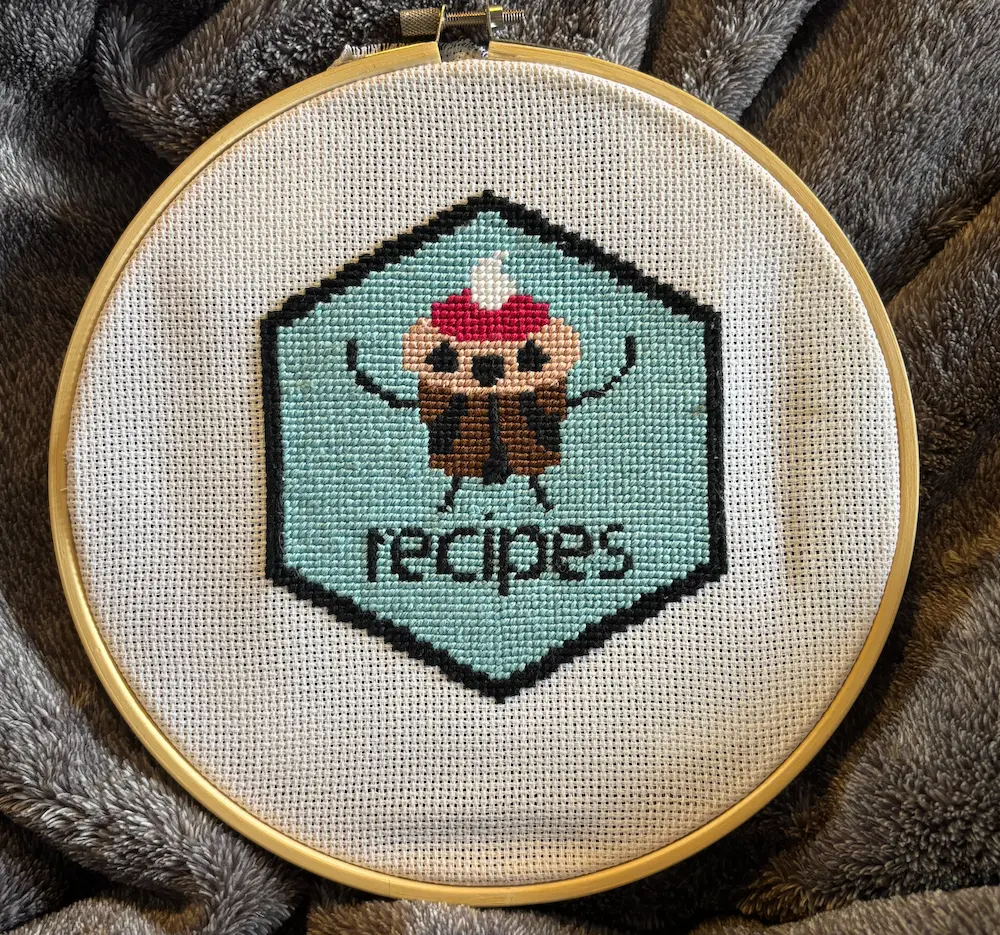

# Data Adjacent Cross Stitch Patterns

This is my humble collection of cross stitch paterns and results.
Specifically data related themes.
I'm happy to accept PRs with your patterns if you see them fit.

## recipes Hex

Pattern created with [FlossCross](https://flosscross.com/):

[recipes.pdf](patterns/recipes.pdf)

Result:

## stacks Hex

Pattern created with [FlossCross](https://flosscross.com/):

[pdf](patterns/stacks/stacks.pdf) | [fcjson](patterns/stacks/stacks.fcjson) | [oxs](patterns/stacks/stacks.oxs) | [svg](patterns/stacks/stacks.oxs) | [pattern-keeper.pdf](patterns/stacks/stacks-pattern-keeper.pdf) 